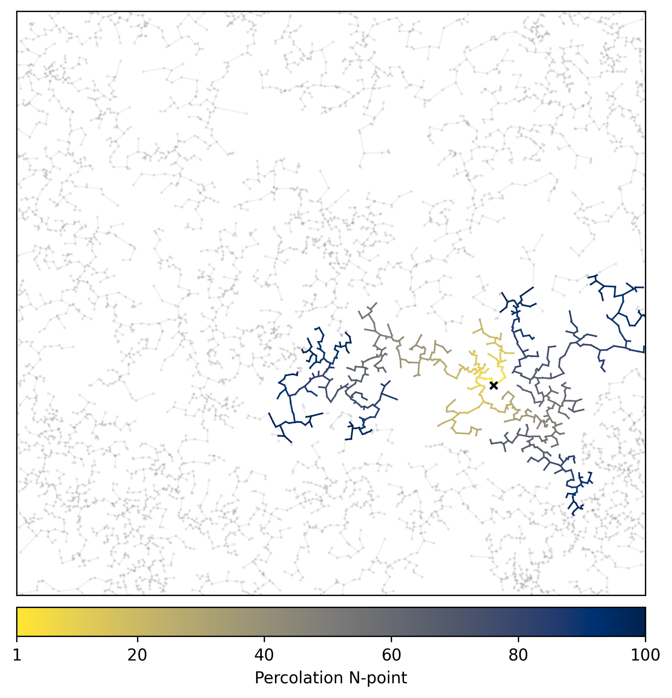
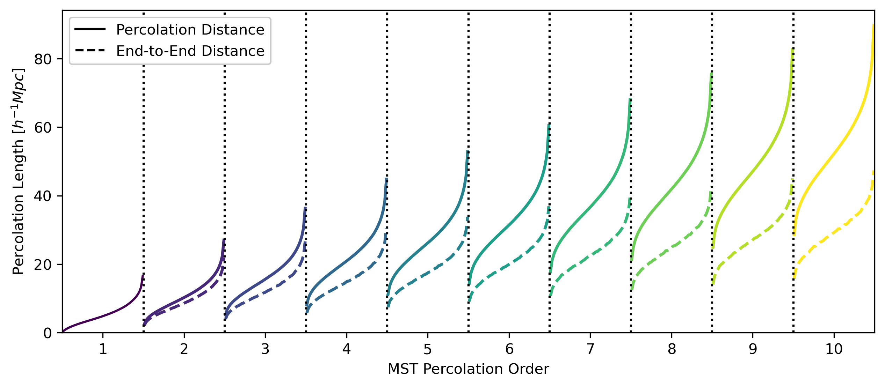

# Minimum Spanning Tree Statistics

The minimum spanning tree (MST), a graph constructed from a distribution of points, draws lines between pairs of points so that all points are linked in a single skeletal structure. The structure/tree contains no loops and the minimal possible total edge length.

<p style="text-align:center;">
    
</p>
<p style="text-align:center;">
    <em>An example MST constructed from a random subset of points.</em>
</p>

## Measuring the MST with the ``MinimumSpanningTree`` class

To `MinimumSpanningTree` class is imported from `acm.estimators.galaxy_clustering.mst`:
```python
from acm.estimators.galaxy_clustering.mst import MinimumSpanningTree
```
To initialise and setup the MST class
```python
mst = MinimumSpanningTree()
# Jitter dispersion scale, the point-process smoothing scale
sigmaJ = 3.
# Size of the box for the simulation data set
boxsize = 1000.
# Order of the maximum percolation statistics
Nthpoint = 10
# OPTIONAL: origin of the box.
origin = 0.
# OPTIONAL: Divide the box, to compute the MST in subboxes.
split = 1
# OPTIONAL: The number of iterations to marginalise over the stochasticity from the jitter dispersion.
iterations = 1
# OPTIONAL: The number of bins used for the MST distributions. 
quartiles = 50
# Setup MST
mst.setup(sigmaJ, boxsize, Nthpoint, origin=origin, split=split, iterations=iterations, quartiles=quartiles)
```

The class can be used to compute *percolation* statistics, which are a way to characterise paths eminating from a single point.

<p style="text-align:center;">
    
</p>
<p style="text-align:center;">
    <em>The percolation paths from a point marked by 'x'. The colormap corresponds to the number of edges percolating along the MST from a single point. The lengths of the paths and the straightline distance between end points are extracted to measure properties of the MST.</em>
</p>

Compute the MST statistics with, where the positions are inputed as `pos` where `x=pos[:,0]`, `y=pos[:,1]` and `z=pos[:,2]`.
```python
mstdict = mst.get_percolation_statistics(pos)
```
Where `mstdict` is a dictionary containing the percolation statistics:
```python
mstdict['mst1pt'] # which gives the distribution of the MST edge lengths.
mstdict['mst2pt'] # which gives the distribution of 2 edges in the MST.
mstdict['end2pt'] # which gives the distribution of the distances between the end points of the associated 2 edges.
```
For the next N-points you can get the statistics for the `N`-th edge distributions using:
```python
mstdict['mst%ipt'%N]
mstdict['end%ipt'%N]
```
and to plot all the outputs:
```python
plot_percolation_statistics(mstdict)
```

<p style="text-align:center;">
    
</p>
<p style="text-align:center;">
    <em>The distribution of the percolation paths. The solid lines correspond to the distance along the MST, and the dashed lines the direct distances between the end points of the paths. </em>
</p>

## MST Emulator Mock Challenge with the ``MinimumSpanningTree`` class

To construct the MST emulators we must first initiate the EMC class and set some variables
```python
from acm.projects.emc_new.mst import MinimumSpanningTree

# define the smoothing scale used for the measurement, either:
# - '0p0' = No point-process smoothing
# - '3p0' = 3 Mpc/h point-process smoothing [DEFAULT]
sigmaJ = '3p0'

# define the rebining value, this averages consecutive bins to 
# reduce the dimensionality of the data vectors
# NOTE: rebin must be a factor of 50 (the total number of bins
# for the MST statistics)
rebin = 5

# define the maximum percolation path distance
# where 1 <= Nptmax <= 10
Nptmax = 10

mst = MinimumSpanningTree(sigmaJ=sigmaJ, rebin=rebin, Nptmax=Nptmax)
```

We now collect the data vectors to compute the covariance matrix for the MST statistics

```python
cov_data = mst.create_covariance()
```

and now to construct the `lhc` file for the MST

```python
cout = mst.create_lhc()
```